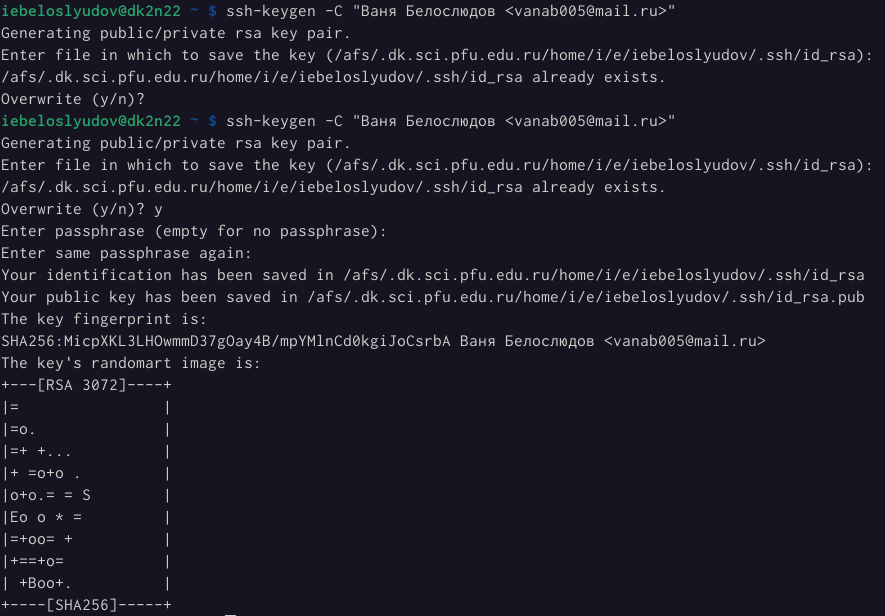
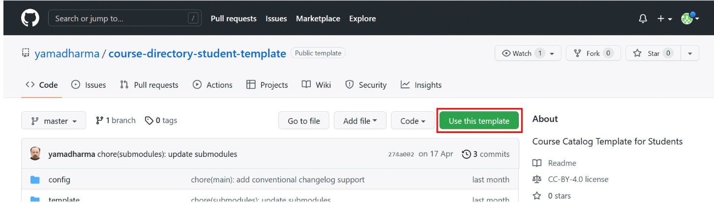
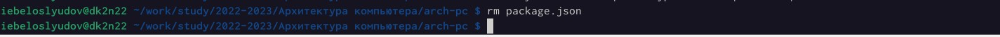

---
## Front matter
title: "Отчет по выполнению лабораторной работы №2"
subtitle: "Архитектура вычислительных систем"
author: "Белослюдов Иван Евгеньевич"

## Generic otions
lang: ru-RU
toc-title: "Содержание"

## Bibliography
bibliography: bib/cite.bib
csl: pandoc/csl/gost-r-7-0-5-2008-numeric.csl

## Pdf output format
toc: true # Table of contents
toc-depth: 2
lof: true # List of figures

fontsize: 12pt
linestretch: 1.5
papersize: a4
documentclass: scrreprt
## I18n polyglossia
polyglossia-lang:
  name: russian
  options:
	- spelling=modern
	- babelshorthands=true
polyglossia-otherlangs:
  name: english
## I18n babel
babel-lang: russian
babel-otherlangs: english
## Fonts
mainfont: PT Serif
romanfont: PT Serif
sansfont: PT Sans
monofont: PT Mono
mainfontoptions: Ligatures=TeX
romanfontoptions: Ligatures=TeX
sansfontoptions: Ligatures=TeX,Scale=MatchLowercase
monofontoptions: Scale=MatchLowercase,Scale=0.9
## Biblatex
biblatex: true
biblio-style: "gost-numeric"
biblatexoptions:
  - parentracker=true
  - backend=biber
  - hyperref=auto
  - language=auto
  - autolang=other*
  - citestyle=gost-numeric
## Pandoc-crossref LaTeX customization
figureTitle: "Рис."
tableTitle: "Таблица"
listingTitle: "Листинг"
lofTitle: "Список иллюстраций"
lolTitle: "Листинги"
## Misc options
indent: true
header-includes:
  - \usepackage{indentfirst}
  - \usepackage{float} # keep figures where there are in the text
  - \floatplacement{figure}{H} # keep figures where there are in the text
---

# Цель работы

Изучить идеологию и применение средств контроля версий. Приобрести практические навыки по работе с системой git.

# Задание

1. Создаем отчет по выполнению лабораторной работы в соответствующем
каталоге рабочего пространства (labs>lab02>report)
https://github.com/VanuaBel/study_2022-2023_arh-pc
2. Скопируем отчеты по выполнению предыдущих лабораторных работ в
соответствующие каталоги созданного рабочего пространства

# Выполнение лабораторной работы

1. Для выполнения лабораторной работы зайдем на сайт https://github.com/ и создадим
учетную запись и заполним данные.

{ #fig:001 width=90% }

2. Сделаем предварительную конфигурацию git. Откройте терминал и
введем следующие команды, указав имя и email владельца репозитория:

{ #fig:002 width=90% }

3. Настроим utf-8 в выводе сообщений git:

{ #fig:003 width=90% }

4. Зададим имя начальной ветки (будем называть её master):

{ #fig:004 width=90% }

5. Параметр autocrlf:

{ #fig:005 width=90% }

6. Параметр safecrlf:

{ #fig:006 width=90% }

7. Для последующей идентификации пользователя на сервере репозиториев
необходимо сгенерировать пару ключей. Ключи сохраняться в каталоге ~/.ssh/

{ #fig:007 width=90% }

8. Необходимо загрузить сгенерённый открытый ключ. Для этого зайдем на сайт
http://github.org/ под своей учётной записью и перейдем в меню Setting . После этого
выбрать в боковом меню SSH and GPG keys и нажать кнопку New SSH key .

{ #fig:008 width=90% }

9. Скопировав из локальной консоли ключ в буфер обмена. Вставляем ключ в
появившееся на сайте поле и указываем для ключа имя (Title).

{ #fig:009 width=90% }

10. Открываем терминал и создаем каталог для предмета «Архитектура компьютера».

{ #fig:010 width=90% }

11. Создаем репозиторию курса на основе шаблона. Перейдите на станицу
репозитория с шаблоном курса https://github.com/yam adharma/course-directory-student-
template. Далее выберите Use this template.

{ #fig:011 width=90% }

12. В открывшемся окне задайдем имя репозитория (Repository name) study_2022–
2023_arh-pc и создайте репозиторий (кнопка Create repository from template).

{ #fig:012 width=90% }

13. Откроем терминал и перейдите в каталог курса:

{ #fig:013 width=90% }

клонируйте созданный репозиторий. Ссылку для клонирования можно скопировать на
странице созданного репозитория Code -> SSH:

{ #fig:014 width=90% }

14. Перейдите в каталог курса:

{ #fig:015 width=90% }

Удалите лишние файлы:

{ #fig:016 width=90% }

Создайте необходимые каталоги:

{ #fig:017 width=90% }

Отправьте файлы на сервер:

{ #fig:018 width=90% }

{ #fig:019 width=90% }

15. Проверьте правильность создания иерархии рабочего пространства в локаль-
ном репозитории и на странице github.

{ #fig:020 width=90% }

{ #fig:021 width=90% }

Самостоятельная работа:
1. Создаем отчет по выполнению лабораторной работы в соответствующем
каталоге рабочего пространства (labs>lab02>report)
https://github.com/VanuaBel/study_2022-2023_arh-pc
2. Скопируем отчеты по выполнению предыдущих лабораторных работ в
соответствующие каталоги созданного рабочего пространства

{ #fig:022 width=90% }

3. Загружаем файлы на github

# Выводы

В ходе выполнения лабораторной работы №2 я изучил идеологию и
применение средств контроля версий. Приобрёл практические навыки по работе с
системой git.

